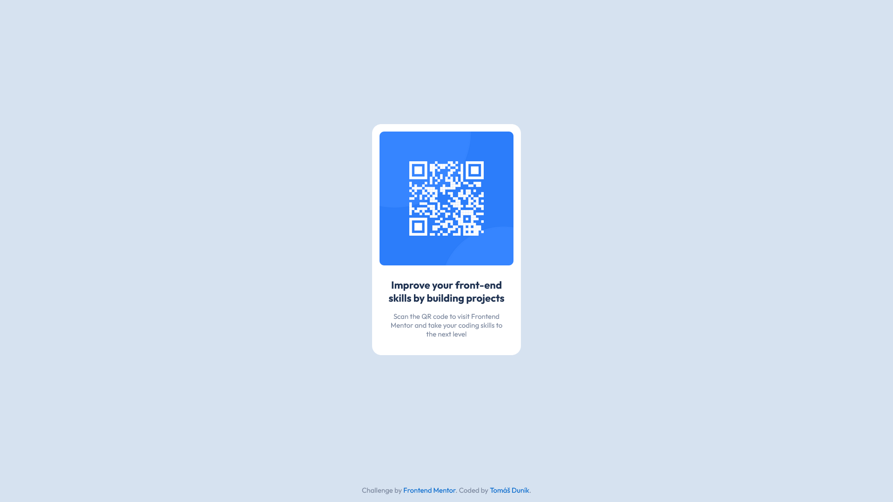

# Frontend Mentor - QR code component

## 📝 Informácie o projekte

Tento projekt je zo stránky [Frontend Mentor](https://www.frontendmentor.io/challenges/qr-code-component-iux_sIO_H). Frontend Mentor je platforma pre webových vývojárov, ktorá umožňuje trénovať frontendové zručnosti riešením reálnych projektov na základe návrhov od profesionálnych dizajnérov.

#### [Odkaz na hotový projekt](https://tomasdunik.github.io/frontend_mentor-QR_code_component/)

## 🏗️ Vytvorenie projektu

Tento projekt je môj prvý zo stránky Frontend Mentor.
 

## 🛠️ Vytvorené s

- HTML
- CSS

## 📸 Screenshots

### 💻 Desktop

### 📱 Mobil

## 🔗 Projekty Frontend Mentor

- [Tento konkrétny projekt na stránke Frontend Mentor](https://www.frontendmentor.io/solutions/frontendmentor-qr-code-component-nwQg_cSxUn)
- [Moje ostatné projekty na stránke Frontend Mentor](https://www.frontendmentor.io/profile/tomasdunik)
